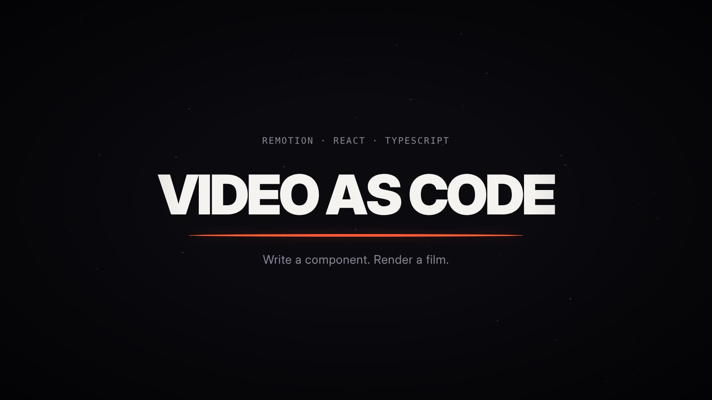

# remotiondev

A [Remotion](https://www.remotion.dev/) video app: React components rendered frame by frame into an MP4.

The repo ships with one finished film, **"Video as code"** — a 17.7 s / 530-frame 1080p30
motion-graphics piece built entirely from code. No stock footage, no image assets, no
network at render time.



The rendered film is committed at [`media/video-as-code.mp4`](media/video-as-code.mp4);
`npm run build` regenerates it into `out/`, which is gitignored.

## Quick start

```bash
npm install
npm run studio      # open the Remotion Studio and scrub the timeline
npm run build       # render out/video.mp4
```

## Scripts

| Script | What it does |
|---|---|
| `npm run studio` | Remotion Studio on `localhost:3000` — live preview, frame scrubbing, prop editing |
| `npm run build` | Renders the `MyComp` composition to `out/video.mp4` |
| `npm run render` | Bare `remotion render` — pass your own composition id and output path |
| `npm run still` | Renders a single frame, e.g. `npm run still -- MyComp out/frame.png --frame=95` |
| `npm run typecheck` | `tsc --noEmit` |

## Layout

```
CLAUDE.md             Remotion house rules for Claude Code (see below)
remotion.config.ts    Render settings and browser resolution
src/
  index.ts            registerRoot
  Root.tsx            <Composition id="MyComp" ... /> — 1920x1080, 30fps
  MyComp.tsx          The film: four scenes joined by a TransitionSeries
  theme.ts            Palette, type stack, beat grid
  scenes/
    Open.tsx          A dot arrives, stretches into a rule, the title rises off it
    Primitives.tsx    Three cards, each running the primitive it names
    Deterministic.tsx A bar field that is a pure function of (index, frame)
    Outro.tsx         The bars fall back into the dot — the film ends where it began
  components/         KineticText, Seed, StarField, Grain, Vignette, Caption
public/               staticFile() assets
media/                The committed film and its poster frame
out/                  Render output (gitignored)
```

### How the film is put together

One object travels through every scene — a single dot. It stretches into a rule under the
title, becomes the three cards, multiplies into the bar field, and collapses back into a
dot at the end. `MyComp.tsx` derives `TOTAL_DURATION` from the scene durations minus one
transition per cut, so the composition length can never drift out of sync with the scenes.

Everything is frame-driven. There is no `Math.random()` anywhere: the dust field, the film
grain and the bar amplitudes all come from Remotion's seeded `random()`, so frame 397 is
byte-identical on every machine and every re-render.

## Rendering

Remotion drives Chrome in old headless mode, which recent full Chrome binaries no longer
support — it needs `chrome-headless-shell`. `remotion.config.ts` resolves a browser in
this order:

1. `REMOTION_BROWSER_EXECUTABLE`, if set and present on disk
2. Playwright's `chrome-headless-shell`, if `PLAYWRIGHT_BROWSERS_PATH` is set
3. Remotion's own managed browser — the normal path on a developer machine

So `npm run build` works unconfigured locally, and reuses the existing browser in CI or a
container where one is already installed.

## CLAUDE.md

`CLAUDE.md` is [Thariq Shihipar's Remotion guide](https://gist.github.com/ThariqS/3d446e7c7aa9eb94f468194deb73028f),
installed verbatim. It gives Claude Code the Remotion component rules — `useCurrentFrame()`,
`interpolate()`, `spring()`, `Sequence` / `Series` / `TransitionSeries`, `OffthreadVideo`,
`staticFile()`, the ban on `Math.random()`, and why a Remotion component is not an
interactive React component. Claude Code reads it automatically; it is the reason the code
in `src/` looks the way it does.
